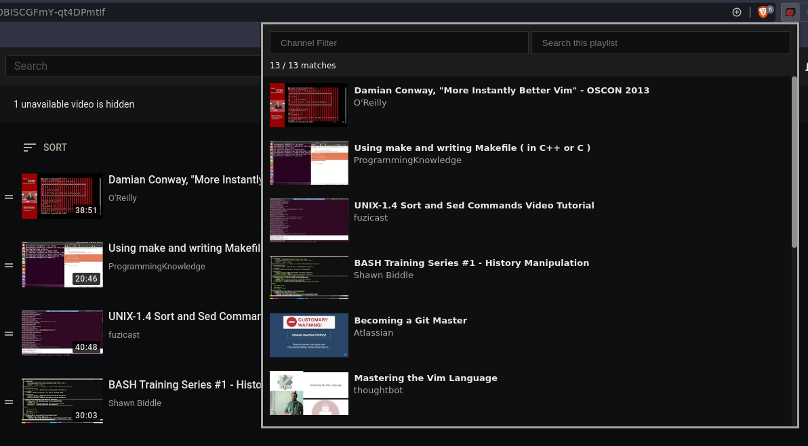
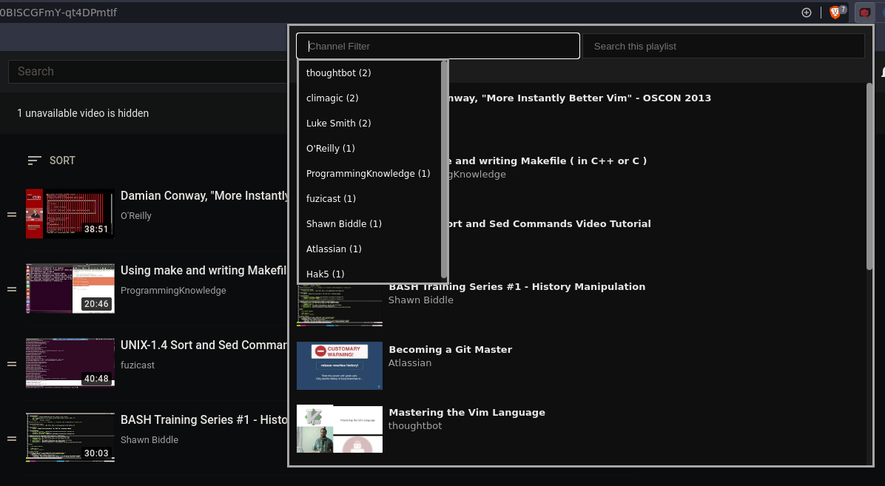
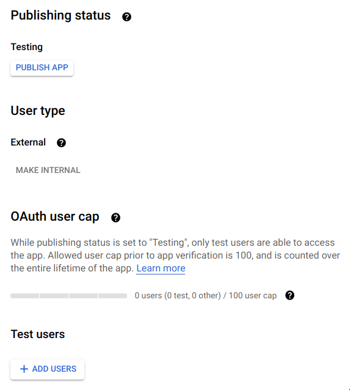
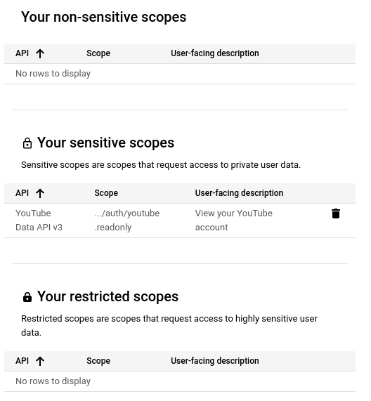

# Youtube Playlist Search

## Donate

### Crypto

Click address for QR code

BTC: [1QCihPNTYRKMhwW6vKjHNkGJkWzR5vdsRp](https://stmhall.ca/btc.png)

ETH: [0xF7A8fed794e5ed89a294b2E6c3f1BcCa03b8ebaC](https://stmhall.ca/eth.png)

LTC: [MMcQLnqeZ6zrfzhLWqwfgoEuKCd5P3ASP4](https://stmhall.ca/ltc.png)

## Description

This started as a copy of the "Playlist Search For YouTube" extension, but I am
cleaning it up and customizing it to my liking.

## Limitations

- You must authenticate with Google when using the extension for the first time
  so that the extension is able to use the YouTube API.
  The YouTube API does not allow access to your "Watch List", so the extension
  will not work on your "Watch List".
- This extension has turned out to be more popular than I anticipated, meaning
  that I have run out of users for my API key. I think the only way to get more
  users allowed is to get this verified, but I tried that a while back and it
  was too much work and took too long (I would get automated emails from Google
  to make a change, I would change it, not hear from them for a few days, then
  get the request for the same change again and never actually get anywhere). As
  a result, I will provide instructions lower down for how to create your own
  API keys.
    - If you try to use this extension without changing the API key, you will
      probably see errors (REF: #7).

## Customizations

- Searching is now more 'fuzzy', so it searches words individually instead of
  together.
- Search by video title
- Searchable channel dropdown
- Videos in the list have a thumbnail
- Removed list.js and jQuery dependencies (jQuery was literally being used for
  list.js and one other thing, and list.js honestly just complicated the script
  more because it just wasn't necessary).
- Cleaned up the code significantly
- Updated and cleaned up CSS
- The UI resembles the YouTube dark theme now.
- Clicking on a video opens the video in a new tab
- Search filter is persistent. The extension will remember the filter you used
  the last time that you did a search for a particular playlist.
- Loading spinner
- Lazy Loading
- Local storage of videos for large playlists for fast retrieval
  - Fetch button to force fetch the playlist from the API

## Installation

I do not have this in the Chrome Extension Store, and I never will. Apparently
Google requires that you pay a $5 registration fee to become an extension
developer now and honestly, I can't be bothered.

If you want to publish this extension in the Chrome Web Store, you are free to
do so. However, I just ask that you:

* Let me know first so I can update this README to say that it is being added
* Let me know when it is approved and published so that I can post the link here
* Let reference this git repo somewhere in the details of the extension so that
  people can easily review the code if they want, and/or submit bug reports or
  feature requests.
* Try and keep the chrome extension in the store relatively up to date with the
  repo.

So, to install this extension:

* Generate API Keys. For instructions on how, see [below section](#generating-api-keys).
* Download, or clone this repository
* Open the `manifest.json` file and replace the `client_id` with the client ID
  you get when you generated the API Key.
* For the 'Brave Browser' only, enable the setting "Allow Google login for
  extensions" and restart the browser (IMPORTANT: This feature is currently
  broken see [below](#brave-browser))
* Open the 'Extensions' page in Chrome settings
* Toggle 'Developer mode' on (this should be in the top right corner)
* Click "Load Unpacked"
* Select the folder that this extension was saved as when you cloned or
  downloaded it.

You should have the extension now.

When you use the extension for the first time you will be required to log in to
a Google account. This extension uses Google's YouTube API, and requires a token
from Google that allows the extension to retrieve information from the API.

Optionally, you can now disable "Developer mode". Chrome should keep the custom
version even after disabling.

## Generating API Keys

- Go to the [Google Developer's Console](https://console.developers.google.com/).
  You will need to login with a Google account.
- You should see something like below. Click on the `Select a project`.

- Select `NEW PROJECT` in the popup.
- You will be asked to give it a name. It doesn't matter what name you choose,
  so long as it means something to you. For the purposes of this tutorial, I am
  going to call it `youtube-playlist-search`.
- Click on `create`.
- Click `select project`.
- You should now see something like below, which is the same as before but now
  it shows you have selected your new project:

- In the left bar there should be something that says `APIs and Services`. Hover
  over it and click `Library` when it expands.
- In the search box search for the `YouTube Data API v3`. When it comes up as a
  result, click it.
- Click `Enable`.
- When the page loads, click `Create Credentials` in the top right corner.
- Make sure the `YouTube Data API v3` is the selected API.
- You need to select that the API will be accessing `User Data`.
- Click `Next`.
- Fill in information about the `OAuth Consent Screen`. This is the screen that
  pops up for users when they need to allow access to this app, so provide a
  user friendly name and your contact info.
  Make sure to leaving in "Testing" mode, and add your email, and the email of
  anyone else you want to use this as "Test users":

- Click `Save and Continue`.
- Now select scopes. For this app you only need the `YouTube Read Only Scope`.
  - Click `Add or Remove Scopes`. Filter for `youtube.readonly`. Check it and
    click `Update`.
- Your Scopes should looks like this:

- Click `Save and Continue`.
- For the `Application Type`, select `Chrome App`, give it any name you want.
- For the Application ID, enter this: `jdolgjncmhmboklhmacpknglmiibbldg`.
- Click `Create`.
- It may take some time, but for me took just a few seconds.
- You should then get a `Client ID`. Copy this, you will need it when installing
  the App.

You are done creating your API Key (The Client ID).

## Brave Browser

You used to be able to use this extension with Brave Browser, but it is broken
right now and the Brave Browser devs know about it. There isn't much they can do
right now apart from wait for Google to do something.

You can see the open Brave Browser ticket [here](https://github.com/brave/brave-browser/issues/15754).

That being said, it looks like this was intentional by Google and may never get
fixed ([ref](https://blog.chromium.org/2021/01/limiting-private-api-availability-in.html)).

Thank you **SO MUCH** Google 🤦

## Why this Extension is Missing from Extension Stores

This extension is currently not in any extension store.

You are free to add it to an extension store if you want, but if you do so I ask
that you:

* Let me know first so I can update this README to say that it is being added
* Let me know when it is approved and published so that I can post the link here
* Let reference this git repo somewhere in the details of the extension so that
  people can easily review the code if they want, and/or submit bug reports or
  feature requests.
* Try and keep the chrome extension in the store relatively up to date with the
  repo.

There are a variety of reasons why this isn't in any extension store, which I
will list below:

### Google Chrome / Chromium Browsers

I do not have this in the Chrome Extension Store because apparently Google
requires that you pay a $5 registration fee to become an extension developer now
and honestly, I can't be bothered, and I find it kind of insulting that I spend
my free time to make a free extension and then I have to pay Google for the
privilege to add it to their store.

### Firefox

Firefox's extension system is significantly different to Chrome, and this is a
Chrome extension. There would be added work involved in getting it working on
Firefox because of this.

I am also not that familiar with extension development, and I don't even know if
you can use the YouTube APIs from Google in Firefox, which I need in order for
this extension to work.

### Edge

In theory, Edge should be easy to do because it is a Chromium based browser.

However, I also don't know if Edge has the ability to use the YouTube API.

But more importantly, I don't have any Windows computers in my home so there is
no way for me to test if Edge even works at all.

This also means that any changes I make in the future will have absolutely 0
testing for Edge before an update.

### Safari

I don't know if Safari has the ability to use the YouTube API.

Like Windows, I don't have any Macs in my home so there is no way for me to test
Safari either, so there is no way to know if it would even work.

This also means that any changes I make in the future will have absolutely 0
testing for Safari before an update.

I also am not familiar with Safari at all and if it even has an extension store
or what is involved in adding it.
